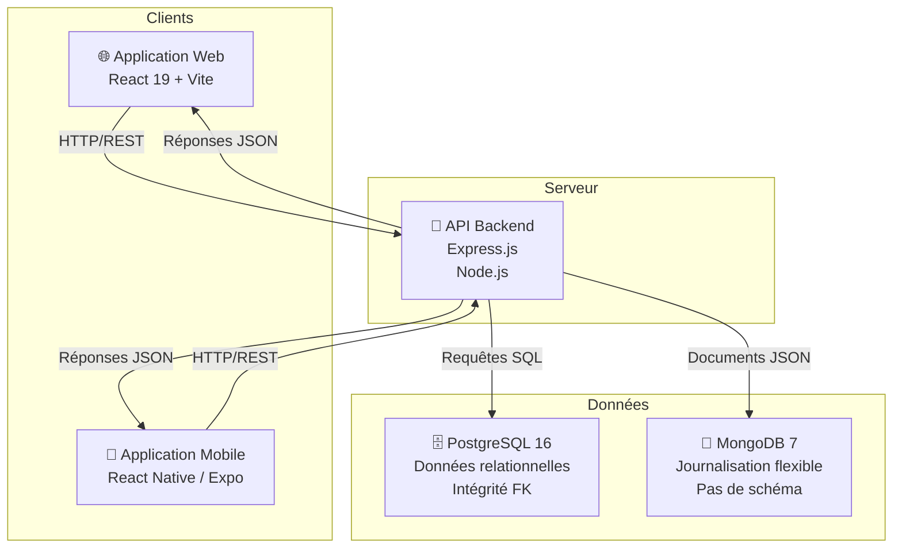
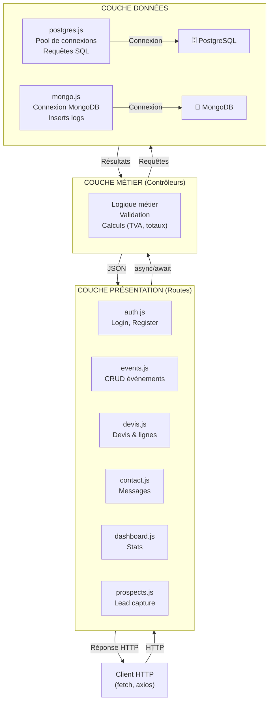
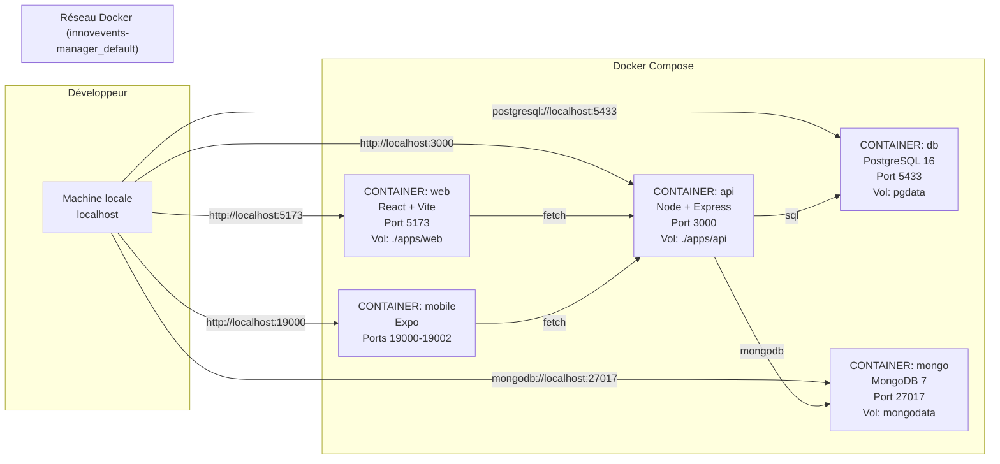
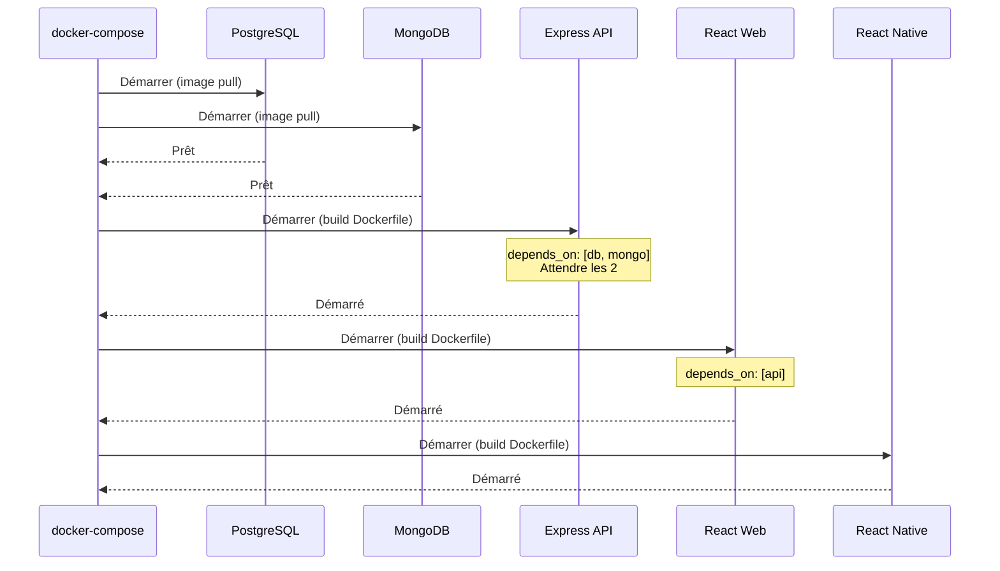
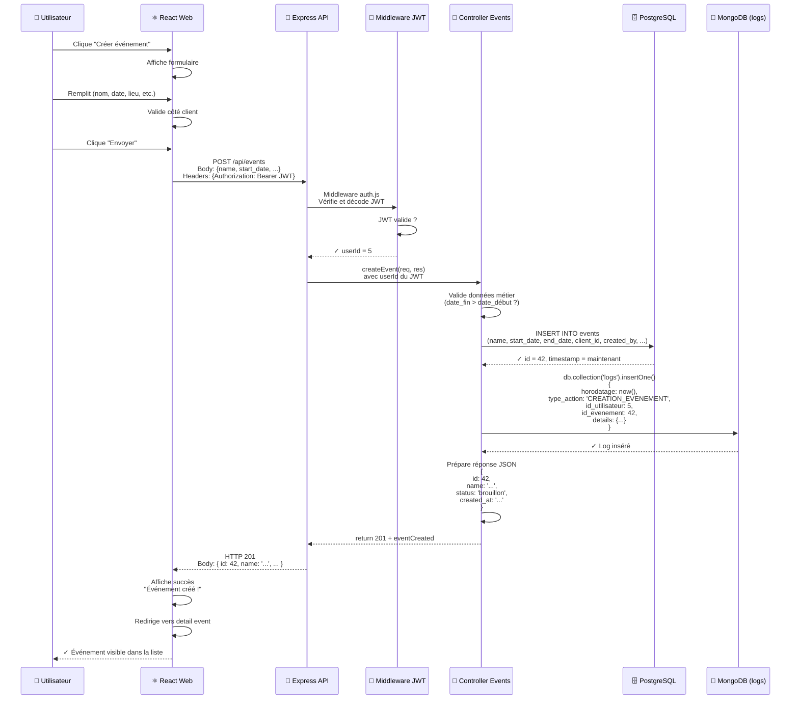
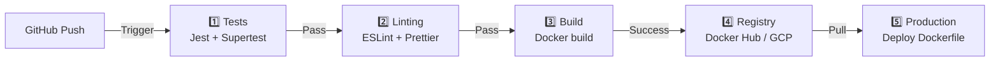

# Architecture - Innov'Events Manager

## 1. Vue d'ensemble

Innov'Events Manager est une application de gestion d'événements conçue selon une architecture **monorepo** (monorépertoire multi-projets). Le système est composé de cinq services interdépendants déployés via Docker Compose.

### Services du projet

```
innovevents-manager/
├── apps/api/       # Backend Express.js (Port 3000)
├── apps/web/       # Frontend React 19 + Vite + Bootstrap 5 (Port 5173)
├── apps/mobile/    # Application mobile React Native / Expo (Ports 19000-19002)
├── db/             # PostgreSQL 16 Alpine (Port 5433)
└── mongo/          # MongoDB 7 (Port 27017)
```

### Raison du monorepo

Le monorepo centralise l'ensemble du projet dans un seul référentiel, facilitant :
- La synchronisation des versions entre frontend et backend
- Le partage de types/modèles de données (TypeScript/JSDoc)
- La gestion simplifiée des dépendances communes
- Le déploiement coordonné via Docker Compose

---

## 2. Architecture applicative

### Flux global de l'application



**Principes architecturaux :**
- **Séparation des préoccupations** : clients, serveur et données sont découplés
- **Communication stateless** : aucun état serveur maintenu entre requêtes
- **Polyglotte de données** : PostgreSQL pour la cohérence, MongoDB pour la flexibilité
- **API REST** : interface standard pour tous les clients

---

## 3. Choix techniques justifiés

### 3.1 Frontend : React 19 + Vite + Bootstrap 5

**Decisions :**
- **React 19** : bibliotheque UI composable, ecosysteme mature, nombreux packages disponibles
- **Vite** : bundler ultra-rapide, HMR (Hot Module Reload) quasi-instantane, demarrage dev rapide
- **Bootstrap 5** : framework CSS responsive pour un prototypage rapide et professionnel

**Justifications :**
- Vite offre une experience developpeur superieure a Webpack (moins de 300ms pour rebuild)
- React 19 apporte des ameliorations de performance par rapport a React 19 (version utilisee initialement avant mise a jour)
- Ecosysteme npm riche pour formulaires, validation, requetes HTTP, etc.
- Bootstrap 5 permet un rendu professionnel avec grille responsive, composants predefinis (modals, cartes, tableaux, formulaires) et classes utilitaires

### 3.2 Backend : Express.js

**Décisions :**
- Framework minimaliste, peu de dépendances

**Justifications :**
- Léger et performant, adapté à un projet scolaire
- Grande flexibilité : choix libre des middlewares
- Écosystème npm très riche (morgan, helmet, cors, rate-limit, etc.)
- Courbe d'apprentissage progressive pour les étudiants
- Facile à tester unitairement et intégrer

### 3.3 Base de données : PostgreSQL 16 Alpine

**Décisions :**
- SGBDR relationnel pour les données transactionnelles
- Image Alpine pour légèreté en développement

**Justifications :**
- Support complet des contraintes d'intégrité (clés étrangères, CHECK, UNIQUE)
- Types énumérés natifs pour statuts (event_status, devis_status, task_status, event_type)
- Modèle de données bien défini avec 13 tables relationnelles
- Transactions ACID garantissent la cohérence commerciale
- Requêtes de reporting faciles (JOINs multi-tables)

**Cas d'usage : prospects, clients, événements, devis, utilisateurs, factures**

### 3.4 Journalisation : MongoDB 7

**Décisions :**
- NoSQL document pour les logs applicatifs
- Format BSON/JSON pour flexibilité

**Justifications :**
- Logs sans schéma fixe : chaque action peut avoir une structure unique
- Pas de migration de schéma lors d'ajout de champs de log
- Opérations d'insertion ultra-rapides (pas d'UPDATEs complexes)
- Agrégations faciles pour audit et analyse
- Scalabilité horizontale future (sharding)

**Cas d'usage : CONNEXION_REUSSIE, CONNEXION_ECHOUEE, CREATION_COMPTE, MODIFICATION_UTILISATEUR, etc.**

### 3.5 Orchestration : Docker Compose

**Décisions :**
- Conteneurisation complète (api, web, db, mongo)
- Orchestration locale simple

**Justifications :**
- Reproductibilité garantie : même environnement dev/staging/prod
- Isolation des services (chacun son espace d'exécution)
- Volumes persistants pour bases de données (pgdata, mongodata)
- Variables d'environnement centralisées
- Pas de "ça marche sur ma machine" : tous les développeurs identiques

### 3.6 Authentification : JWT (JSON Web Tokens)

**Décisions :**
- Tokens stateless, signature HMAC-SHA256
- Secret stocké en variable d'environnement (JWT_SECRET)

**Justifications :**
- **Stateless** : le serveur n'a pas besoin de stocker les sessions
- **Scalable** : fonctionne parfaitement en cluster (multiple instances API)
- **Mobile-friendly** : les tokens se stockent facilement dans AsyncStorage (React Native)
- **Expiration naturelle** : chaque token a un `exp` claim (à implémenter)
- **Audit facile** : le userId est dans le JWT, on peut logger sans requête DB

### 3.7 Génération PDF : PDFKit

**Décisions :**
- Génération côté serveur des documents PDF
- Flux binaire directement vers le client

**Justifications :**
- Évite la surcharge du navigateur (surtout mobile)
- Consistent : mêmes fonts/mise en page pour tous
- Sécurité : le client ne voit que le résultat final, pas les données source
- Performance : cache côté serveur possible

**Cas d'usage : devis, factures, certificats d'événement**

### 3.8 Bootstrap 5

**Decisions :**
- Utilisation de Bootstrap 5 comme framework CSS principal

**Justifications :**
- Grille responsive 12 colonnes pour adaptation mobile/desktop
- Composants predefinis (modals, cartes, tableaux, formulaires, alertes, badges) qui accelerent le developpement
- Systeme de classes utilitaires (spacing, flexbox, text alignment)
- Compatibilite navigateurs geree par le framework
- Documentation complete et communaute large

---

## 4. Architecture en couches (Backend)

### Modèle en 3 couches



### Responsabilités par couche

#### Couche Présentation (Routes)
Fichiers : `/apps/api/src/routes/*.js`

- **Fonction** : recevoir les requêtes HTTP et renvoyer des réponses
- **Responsabilité** : extraction des paramètres (route, query, body)
- **Validation** : schémas de requête (non implémentée en basic)
- **Exemple** :
  ```
  POST /api/events → events.js
  → appelle controller logique
  → retourne 201 + événement créé
  ```

#### Couche Métier (Contrôleurs)
Au sein des fichiers routes (pas de dossier séparé)

- **Fonction** : exécuter la logique applicative
- **Responsabilité** : calculs, validations métier, orchestration
- **Exemples** :
  - Calculer TVA et totaux pour devis
  - Convertir prospect → client
  - Valider transition de statut (brouillon → envoyé)
  - Générer référence devis (DEV-2026-0001)

#### Couche Données
Fichiers : `/apps/api/src/db/*.js`

- **Fonction** : communiquer avec PostgreSQL et MongoDB
- **Responsabilité** : queries SQL, transactions, logs
- **Pattern** : Singleton (une pool unique par base)

**postgres.js** :
```javascript
// Pool partagée
const pool = new Pool({...})
// Exportée pour les routes
```

**mongo.js** :
```javascript
// Connexion unique à MongoDB
const client = new MongoClient(...)
// Exportée pour logs
```

---

## 5. Architecture Docker

### Composition des services



### Variables d'environnement

**Dans docker-compose.yml :**

| Service | Variable | Valeur | Rôle |
|---------|----------|--------|------|
| api | PORT | 3000 | Port d'écoute Express |
| api | NODE_ENV | development | Mode développement |
| api | DATABASE_URL | postgresql://postgres:postgres@db:5432/innovevents | Connexion PostgreSQL (intra-réseau Docker) |
| api | MONGO_URL | mongodb://mongo:27017/innovevents | Connexion MongoDB (intra-réseau Docker) |
| api | JWT_SECRET | innov_events_secret_key_2024 | Clé de signature des JWTs |
| api | SMTP_* | Mailtrap config | Configuration email (optionnel) |
| web | VITE_API_URL | http://localhost:3000 | URL API côté frontend |
| db | POSTGRES_PASSWORD | postgres | Mot de passe PostgreSQL |
| db | POSTGRES_USER | postgres | Utilisateur PostgreSQL |
| db | POSTGRES_DB | innovevents | Nom base de données |

### Volumes persistants

```
Host Machine
    └─ pgdata/
       └─ /var/lib/postgresql/data (dans le container)
    └─ mongodata/
       └─ /data/db (dans le container)
```

**Raison** : sans volumes, les données disparaîtraient au redémarrage du container (volumes nommés = persistance).

### Ordre de démarrage



---

## 6. Flux de données (Exemple : créer un événement)

### Scénario : l'utilisateur crée un événement via l'interface web



### Points clés du flux

1. **Authentification stateless** : le JWT contient l'userId, zéro requête DB pour vérifier l'identité
2. **Séparation responsabilités** : validation (React) → métier (API) → données (PostgreSQL)
3. **Audit complet** : MongoDB enregistre qui a créé quoi et quand
4. **Résilience** : même si le log MongoDB échoue, la transaction PostgreSQL reste valide (gérer l'erreur en attendant un système de queue)

---

## 7. Patterns d'architecture utilisés

### 7.1 Pattern Middleware (Express)

**Localisation** : `/apps/api/src/middlewares/auth.js`

```javascript
// Middleware = fonction (req, res, next)
const authMiddleware = (req, res, next) => {
  const token = req.headers.authorization?.split(' ')[1];

  if (!token) return res.status(401).json({ error: 'Pas de token' });

  try {
    const decoded = jwt.verify(token, process.env.JWT_SECRET);
    req.user = decoded;
    next(); // Passer au handler suivant
  } catch (err) {
    return res.status(401).json({ error: 'Token invalide' });
  }
};

app.use('/api/events', authMiddleware, eventsRoutes);
```

**Avantage** : réutilisable, découplé des routes spécifiques

---

### 7.2 Pattern Singleton (Base de données)

**Localisation** : `/apps/api/src/db/postgres.js` et `/apps/api/src/db/mongo.js`

```javascript
// postgres.js
let pool = null;

function getPool() {
  if (!pool) {
    pool = new Pool({
      connectionString: process.env.DATABASE_URL
    });
  }
  return pool;
}

module.exports = { getPool };
```

**Avantage** :
- Une seule pool de connexions (sinon explosion du nombre de connexions)
- Réutilisée par tous les handlers
- Gestion automatique du pooling

---

### 7.3 Pattern Context (React Frontend)

Bien qu'en développement, typiquement :

```javascript
// AuthContext.js
const AuthContext = createContext();

export function useAuth() {
  const context = useContext(AuthContext);
  if (!context) throw new Error('useAuth hors du provider');
  return context; // { user, login(), logout() }
}
```

**Avantage** : state global d'authentification sans props drilling

---

### 7.4 Pattern Repository (Données)

Bien que minimal, le `/apps/api/src/routes/events.js` contient une logique de requête :

```javascript
const result = await pool.query(
  'SELECT * FROM events WHERE id = $1',
  [req.params.id]
);
```

**À terme** : créer `/apps/api/src/repositories/EventRepository.js` :

```javascript
class EventRepository {
  async findById(id) {
    return await pool.query('SELECT * FROM events WHERE id = $1', [id]);
  }

  async create(eventData) {
    return await pool.query('INSERT INTO events (...) VALUES (...)', [...]);
  }
}
```

---

## 8. Points de sécurité

### 8.1 CORS (Cross-Origin Resource Sharing)

**Implémentation** (`/apps/api/src/app.js`) :

```javascript
const allowedOrigins = [
  "http://localhost:5173",    // Vite dev
  "http://localhost:3000",    // Same-origin
  process.env.FRONTEND_URL    // Production
].filter(Boolean);

app.use(cors({
  origin: (origin, callback) => {
    if (!origin || allowedOrigins.includes(origin)) {
      callback(null, true);
    } else {
      callback(new Error("Origine non autorisée"));
    }
  },
  credentials: true
}));
```

**Sécurité** : évite les attaques CSRF, les requêtes de domaines malveillants

### 8.2 Helmet (Sécurité HTTP)

```javascript
app.use(helmet());
```

**Protections** : X-Frame-Options, X-Content-Type-Options, Strict-Transport-Security, etc.

### 8.3 Rate Limiting

```javascript
const globalLimiter = rateLimit({
  windowMs: 15 * 60 * 1000, // 15 minutes
  max: 100,                  // 100 requêtes
  message: "Trop de requêtes..."
});

const authLimiter = rateLimit({
  windowMs: 15 * 60 * 1000,
  max: 10,  // Strict pour login (force brute)
  message: "Trop de tentatives..."
});

app.use(globalLimiter);
app.post('/api/auth/login', authLimiter, authRoutes);
```

**Sécurité** : prévient les attaques DoS, force brute sur login

### 8.4 JWT avec Expiration

À implémenter dans les tokens :

```javascript
const token = jwt.sign(
  { userId: user.id, role: user.role },
  process.env.JWT_SECRET,
  { expiresIn: '24h' }  // ← Token expiration
);
```

---

## 9. Modèle de données relationnelles

### Entités principales

```
prospects ──(conversion)──> clients ──(lien 1:1)──> users
                                │
                                ├─ 1:N ─> events
                                │           ├─ 1:N ─> prestations
                                │           ├─ 1:N ─> event_notes
                                │           └─ 1:N ─> event_tasks
                                │
                                └─ 1:N ─> devis
                                           └─ 1:N ─> lignes_devis
```

### Énumérés PostgreSQL

```sql
event_type      → ENUM('seminaire', 'conference', 'soiree_entreprise', 'team_building', 'inauguration', 'autre')
event_status    → ENUM('brouillon', 'en_attente', 'accepte', 'en_cours', 'termine', 'annule')
task_status     → VARCHAR('a_faire', 'en_cours', 'terminee', 'annulee')
task_priority   → VARCHAR('basse', 'normale', 'haute', 'urgente')
devis_status    → ENUM('brouillon', 'envoye', 'en_etude', 'modification', 'accepte', 'refuse')
prospect_status → ENUM('a_contacter', 'contacte', 'qualifie', 'refuse')
review_status   → ENUM('en_attente', 'valide', 'refuse')
```

**Avantage** : validation au niveau BD, pas de typos en application

---

## 10. Workflow métier clés

### Conversion Prospect → Client

```
1. Prospect crée demande via formulaire public
   → INSERT prospects (status='a_contacter')

2. Employé qualifie le prospect
   → UPDATE prospects SET status='qualifie'

3. Prospect accepte et devient client
   → INSERT clients (firstname, lastname, email, ...)
   → UPDATE prospects SET client_id=X, status='converti'

4. Créer compte client (optionnel)
   → INSERT users (email, role='client', ...)
   → UPDATE clients SET user_id=Y
```

### Cycle de vie d'un Dévis

```
1. Employé crée brouillon
   → INSERT devis (status='brouillon')
   → INSERT lignes_devis (quantité, prix HT, TVA)

2. Calcul automatique
   → total_ht = SUM(lignes.quantity * lignes.unit_price_ht)
   → total_tva = SUM(lignes.total_tva)
   → total_ttc = total_ht + total_tva

3. Devis envoyé au client
   → UPDATE devis SET status='envoye', sent_at=NOW()
   → Génération PDF avec PDFKit
   → Email au client avec pièce jointe
   → MongoDB log: 'ENVOI_DEVIS', id_devis=X

4. Client répond
   → Si accepté : UPDATE devis SET status='accepte', accepted_at=NOW()
   → Si refusé : UPDATE devis SET status='refuse', refused_at=NOW()

5. Créer événement lié (si accepté)
   → INSERT events FROM devis data
```

---

## 11. Déploiement et évolution

### Environnement local (Développement)

```bash
docker-compose up --build
```

Services lancés : api, web, db, mongo, mobile

### Pipeline CI/CD recommandé



### Considérations de scalabilité

**Actuellement (MVP)** :
- Une instance API
- Une base PostgreSQL
- Une MongoDB

**Pour production** :
- Nginx/Load Balancer devant multiple instances API
- Clustering PostgreSQL (Replication)
- MongoDB Atlas (cloud) ou cluster MongoDB
- Redis pour cache (sessions, rate-limit distributed)

---

## 12. Conclusion

L'architecture d'Innov'Events Manager suit les bonnes pratiques modernes :

✅ **Monorepo** pour cohésion projet
✅ **Séparation frontend/backend** pour indépendance
✅ **Docker Compose** pour reproductibilité
✅ **PostgreSQL + MongoDB** pour polyglottisme données
✅ **JWT stateless** pour scalabilité
✅ **Middlewares** pour code réutilisable
✅ **Architecture en couches** pour maintenabilité
✅ **Sécurité baseline** (CORS, Helmet, Rate-limit)

Le système est **prêt pour un MVP** (Minimum Viable Product) et scalable pour passer en production avec ajustements mineurs (cache, clustering, monitoring).

---

**Document généré** : Architecture de projet scolaire Innov'Events Manager
**Année** : 2026
**Auteur** : Equipe développement
