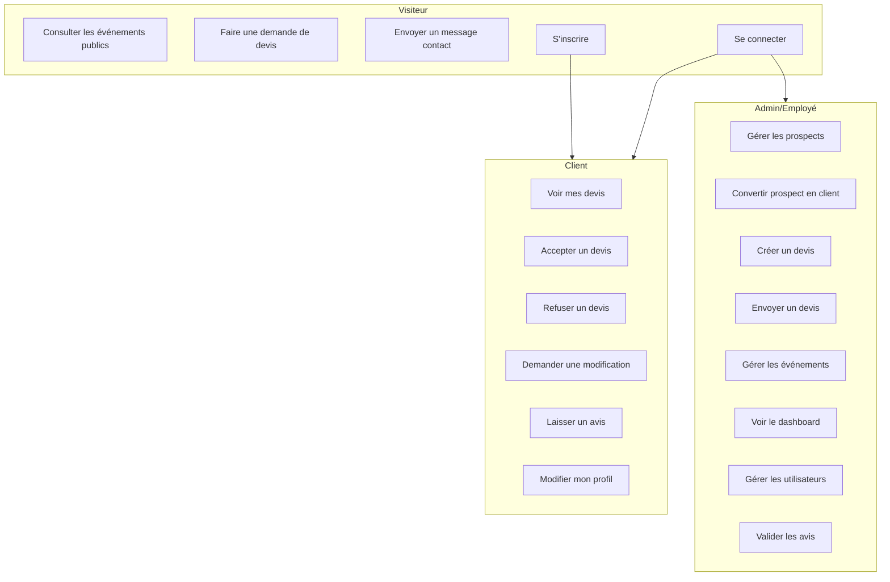
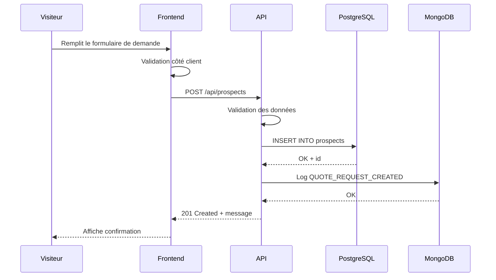
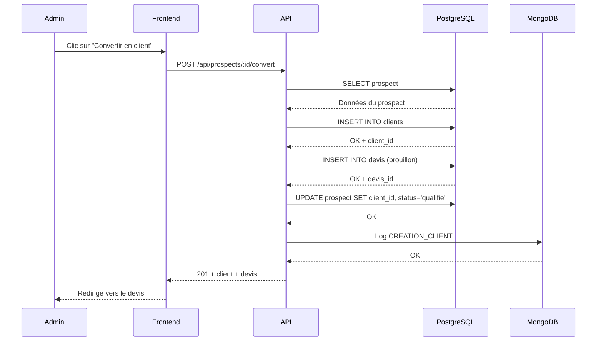
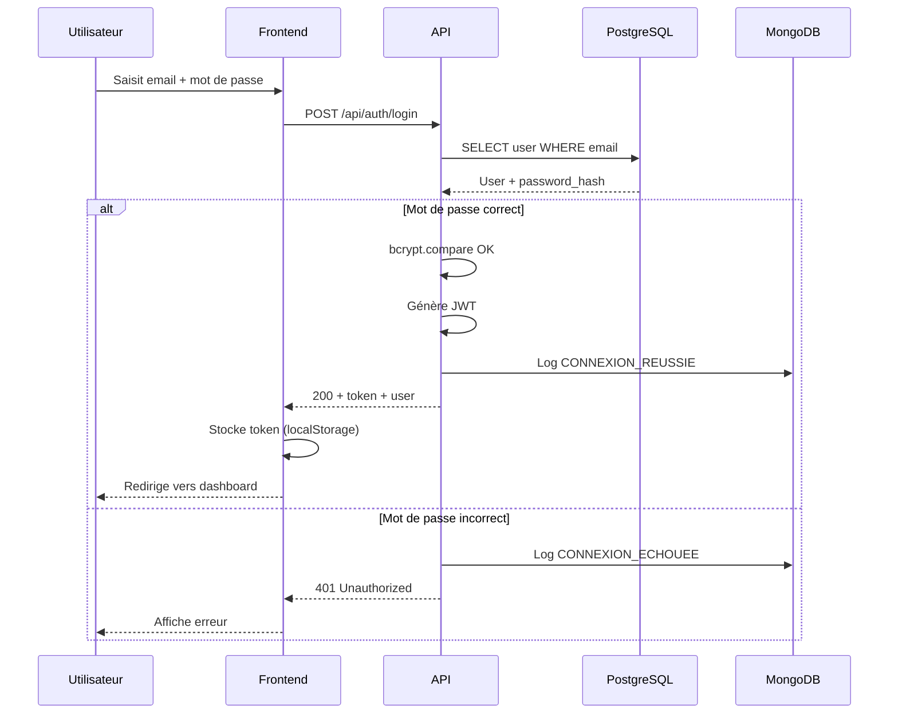
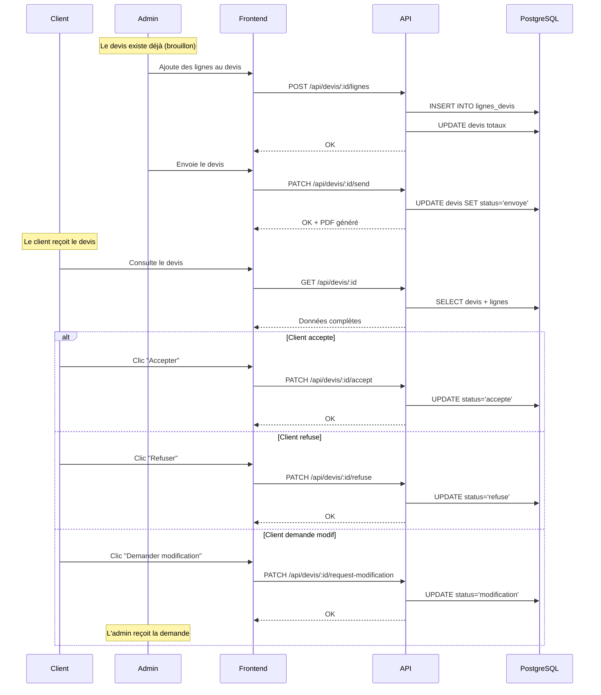
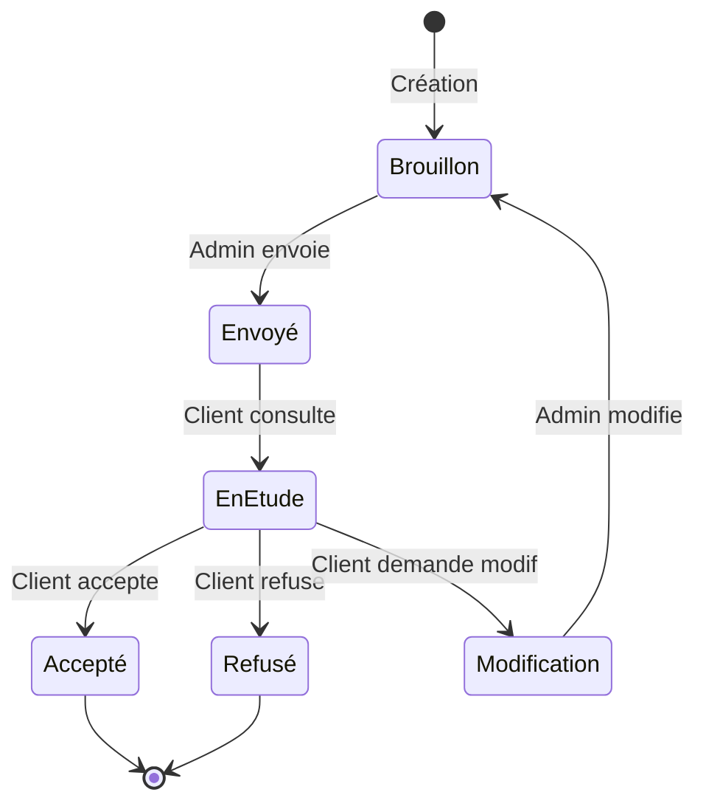
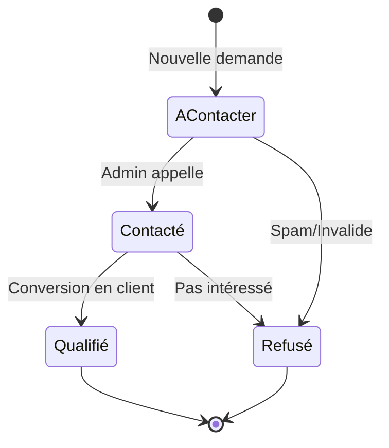
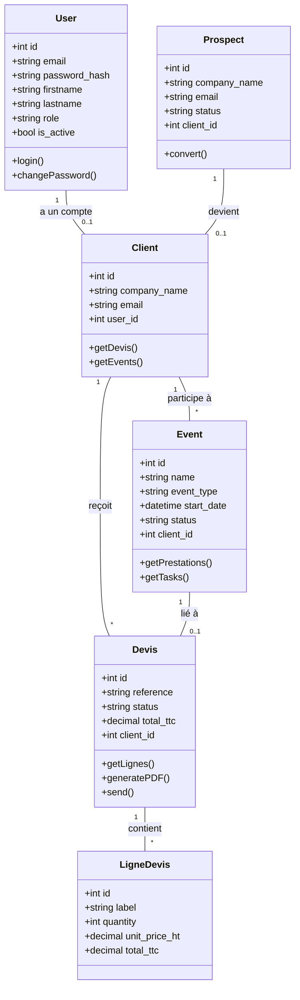
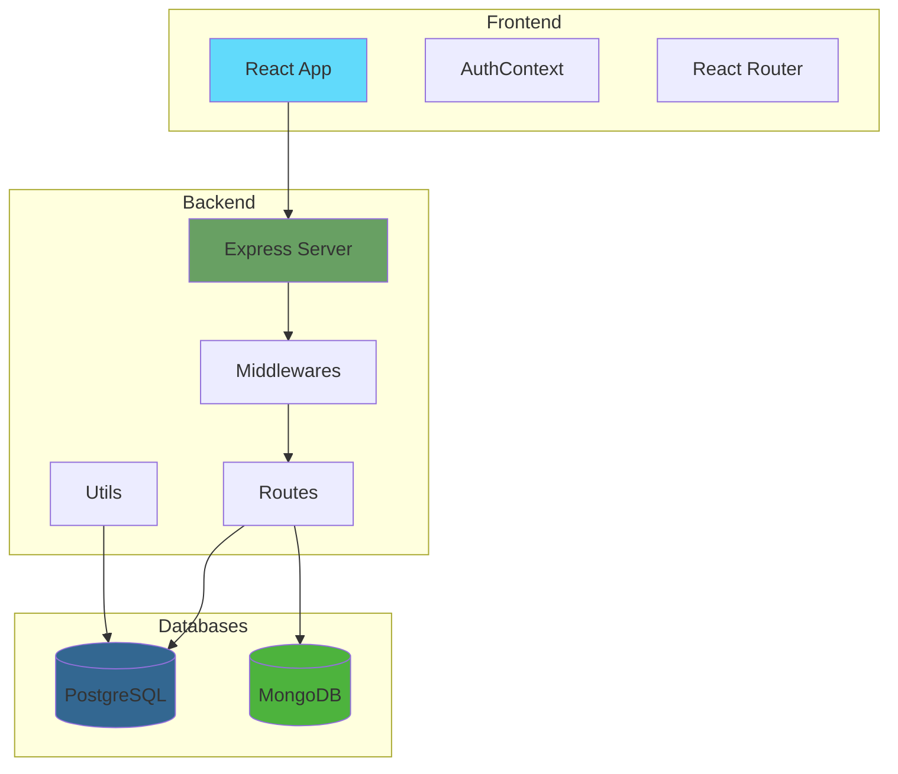

# Diagrammes UML

Ce document contient les principaux diagrammes du projet. Ils sont écrits en syntaxe Mermaid donc ils devraient s'afficher correctement sur GitHub/GitLab.

## Diagramme de cas d'utilisation

## Diagramme de séquence - Demande de devis

Ce diagramme montre ce qui se passe quand quelqu'un fait une demande de devis depuis le site.

## Diagramme de séquence - Conversion prospect → client

## Diagramme de séquence - Authentification

## Diagramme de séquence - Workflow complet d'un devis

## Diagramme d'états - Cycle de vie d'un devis

## Diagramme d'états - Cycle de vie d'un prospect

## Diagramme de classes simplifié

## Architecture technique

