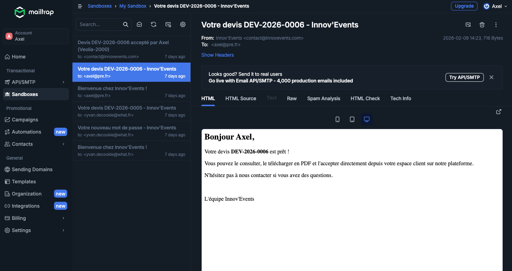
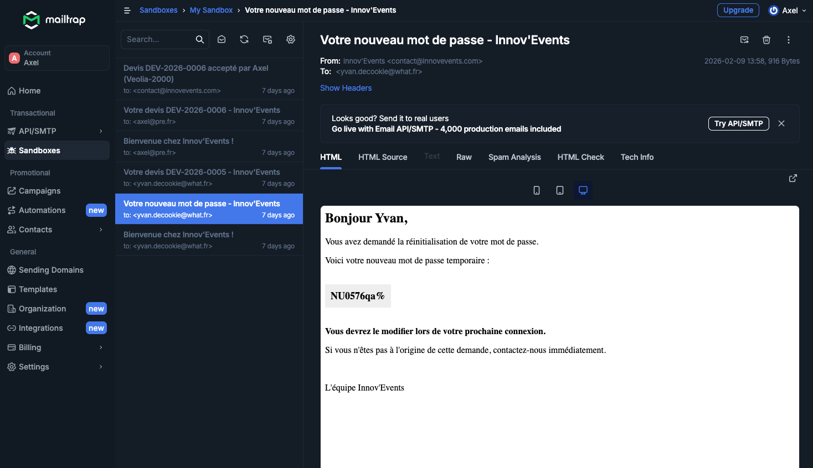

# Systeme d'envoi d'emails

Documentation du systeme de notifications par email d'Innov'Events.

## Architecture

Le systeme d'emails est base sur **Nodemailer** avec une configuration SMTP externalisee via variables d'environnement. Le module `apps/api/src/utils/mailer.js` centralise toute la logique d'envoi.

### Principe de fonctionnement

Le mailer est concu pour etre **non-bloquant** : si la configuration SMTP est absente ou invalide, l'application continue de fonctionner normalement. Les emails non envoyes sont logues en console avec le destinataire et le sujet, ce qui permet de verifier le bon declenchement des notifications meme sans serveur SMTP.

```
Utilisateur → Action (inscription, devis...) → Route API → mailer.js → SMTP → Email
                                                              ↓ (si SMTP absent)
                                                         Log console + continue
```

## Emails envoyes par l'application

L'application envoie 4 types d'emails, chacun declenche par une action utilisateur specifique :

### 1. Email de bienvenue (inscription)

**Declencheur** : `POST /api/auth/register` - creation d'un nouveau compte client

**Destinataire** : le nouvel utilisateur

**Contenu** : message de bienvenue personnalise avec le prenom et l'email du compte cree.

**Fichier** : `auth.js` ligne 106 → `sendWelcomeEmail(user)`

### 2. Reinitialisation de mot de passe

**Declencheur** : `POST /api/auth/forgot-password` - demande de mot de passe oublie

**Destinataire** : l'utilisateur qui a fait la demande

**Contenu** : mot de passe temporaire genere aleatoirement (via `crypto.randomInt`, pas `Math.random`). L'utilisateur devra le modifier a la prochaine connexion (`must_change_password = TRUE`).

**Fichier** : `auth.js` ligne 265 → `sendPasswordResetEmail(user, tempPassword)`

### 3. Notification d'envoi de devis

**Declencheur** : `PUT /api/devis/:id/send` - envoi d'un devis au client par un admin/employe

**Destinataire** : le client associe au devis

**Contenu** : reference du devis et invitation a consulter l'espace client pour le visualiser, telecharger le PDF et accepter/refuser.

**Fichier** : `devis.js` ligne 397 → `sendDevisEmail(clientEmail, clientFirstname, devisReference)`

### 4. Notification d'acceptation de devis

**Declencheur** : `PUT /api/devis/:id/accept` - acceptation d'un devis par le client

**Destinataire** : l'adresse admin (contact@innovevents.com par defaut)

**Contenu** : notification que le devis a ete accepte, avec la reference et le nom du client.

**Fichier** : `devis.js` ligne 481 → `sendDevisAcceptedNotification(devis.reference, clientName)`

## Configuration SMTP

Les variables d'environnement suivantes controlent la configuration email :

| Variable | Description | Valeur par defaut |
|----------|-------------|-------------------|
| `SMTP_HOST` | Serveur SMTP | `sandbox.smtp.mailtrap.io` |
| `SMTP_PORT` | Port SMTP | `587` |
| `SMTP_USER` | Identifiant SMTP | (vide) |
| `SMTP_PASS` | Mot de passe SMTP | (vide) |
| `SMTP_FROM` | Adresse d'expedition | `contact@innovevents.com` |

### Environnement de developpement

En developpement, le projet utilise **Mailtrap** (https://mailtrap.io), un service de test d'emails qui intercepte tous les emails envoyes sans les delivrer aux vrais destinataires. Cela permet de tester le systeme d'emails en toute securite.

### Environnement de production

En production, la meme configuration Mailtrap est utilisee pour capturer les emails de demonstration. Pour passer a un envoi reel, il suffirait de remplacer les identifiants SMTP par ceux d'un fournisseur de production (Brevo, SendGrid, OVH, etc.).

## Verification du fonctionnement

La fonction `isMailConfigured()` verifie la presence des identifiants SMTP avant chaque envoi. Si les variables `SMTP_USER` et `SMTP_PASS` sont absentes, l'email n'est pas envoye et un message est logue :

```
[MAIL] Config SMTP manquante - Email non envoyé
[MAIL] Destinataire: user@example.com
[MAIL] Sujet: Bienvenue chez Innov'Events !
```

En cas d'envoi reussi :

```
[MAIL] Email envoyé à user@example.com (id: <message-id>)
```

## Captures d'ecran

Les captures ci-dessous montrent les emails recus dans l'inbox Mailtrap lors des tests :

### Email de bienvenue (inscription)


### Email d'envoi de devis au client



### Email de notification d'acceptation de devis


### Email de reinitialisation de mot de passe



## Securite

- Les mots de passe temporaires sont generes avec `crypto.randomInt()` (CSPRNG) et non `Math.random()`
- Les emails sont envoyes de maniere asynchrone (`.catch()`) pour ne pas bloquer la reponse API
- Les erreurs d'envoi sont loguees mais ne provoquent pas d'erreur 500 cote client
- Aucune donnee sensible (mot de passe permanent, token JWT) n'est transmise par email
